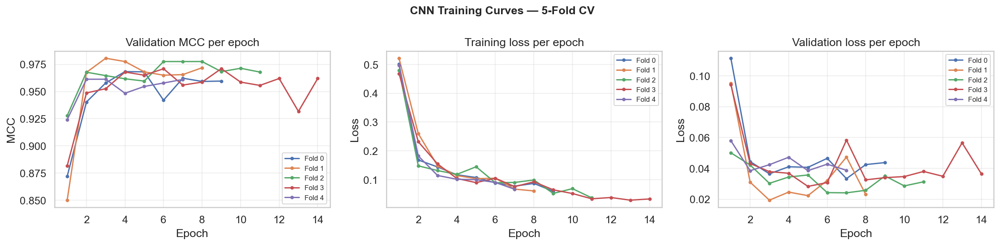
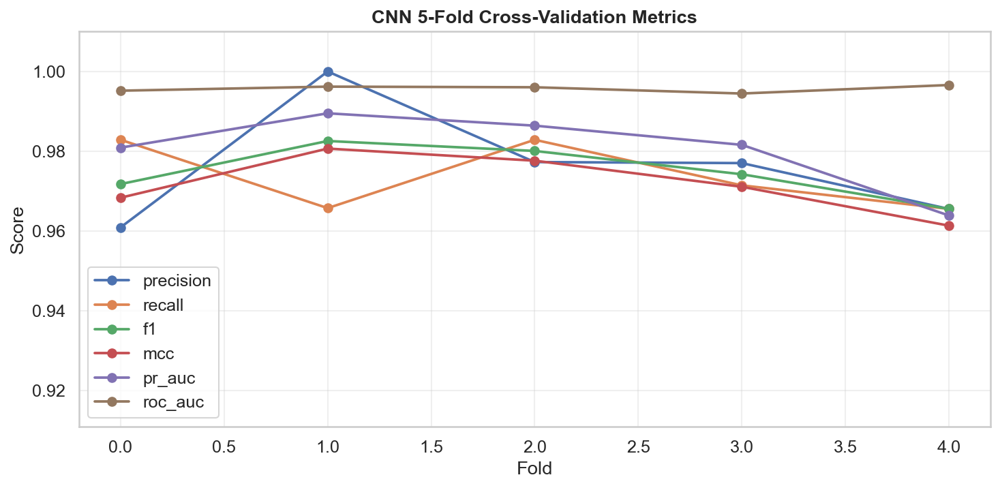
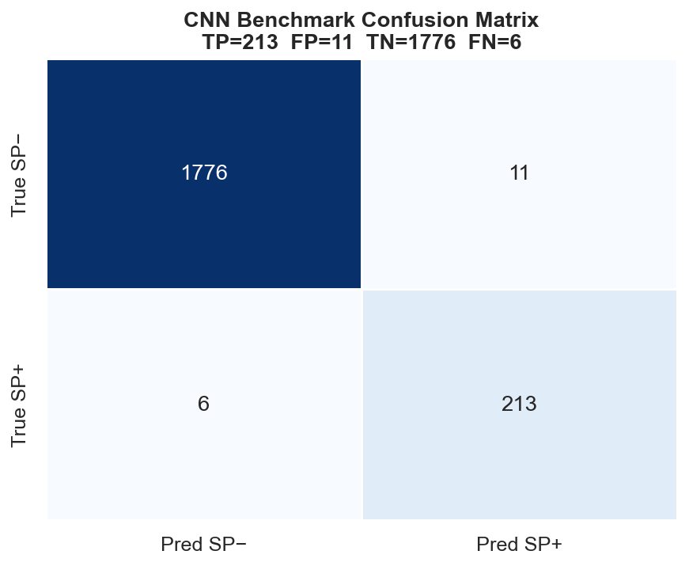
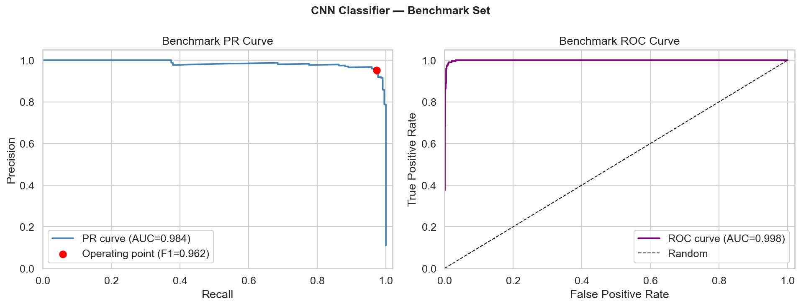

# Step 6 — Deep Learning Signal Peptide Classifier (CNN + BiLSTM on ESM-2 Embeddings)

**LB2 Project · Group 7 · Signal Peptide Prediction Pipeline**

This step trains a deep learning classifier for binary signal peptide detection. The key design decision here is the choice of input representation: rather than hand-crafting biochemical features (as in Step 5) or using simple one-hot encodings, we use **ESM-2 protein language model embeddings** as input. These embeddings encode evolutionary and structural context learned from hundreds of millions of protein sequences, giving the model a much richer starting point than raw sequence identity. A hybrid **1D CNN + bidirectional LSTM** architecture then extracts local and sequential patterns from these embeddings to make the final prediction.

---

## Overview

The model takes the N-terminal 150 amino acids of each protein, encodes them with a pretrained ESM-2 model (35M parameters), and passes the resulting per-residue embedding matrix through a convolutional feature extractor and a bidirectional LSTM before predicting signal peptide presence. Training uses 5-fold cross-validation with early stopping and learning rate scheduling. A final model is retrained on the complete training set and evaluated once on the held-out benchmark.

---

## Repository Contents

```
6- Deep_Learning/
├── step6_deep_learning_final3_fixed.ipynb   # Main notebook — full pipeline
├── cnn_signal_peptide_model.pt              # Saved final model weights (PyTorch)
├── cnn_cv_results.tsv                       # Per-fold CV metrics (5 folds)
├── cnn_model_comparison.tsv                 # Benchmark comparison vs. baselines
├── cnn_training_history.tsv                 # Per-epoch training history across all folds
└── figures/
    ├── cnn_training_curves.pdf/.png         # Validation MCC and loss curves per fold
    ├── cnn_cv_metrics.pdf/.png              # All CV metrics across folds (line plot)
    ├── cnn_benchmark_confusion.pdf/.png     # Benchmark confusion matrix
    └── cnn_benchmark_pr_roc.pdf/.png        # Benchmark PR and ROC curves
```

---

## Input Files

| File | Source Step | Description |
|---|---|---|
| `training_with_folds.tsv` | Step 2 | Training set with preassigned 5-fold split indices |
| `benchmarking_set.tsv` | Step 2 | Held-out benchmark set (never seen during training) |
| `filtered_positive.tsv` | Step 2 | Non-redundant SP+ accession set |
| `filtered_negative.tsv` | Step 2 | Non-redundant SP− accession set |
| `positive.fasta` | Step 1 | Full SP+ sequence collection |
| `negative.fasta` | Step 1 | Full SP− sequence collection |

Only accessions present in `filtered_positive.tsv` and `filtered_negative.tsv` are used, keeping the training data consistent with Steps 4 and 5.

---

## Pipeline

The notebook is structured as a series of numbered cells:

1. **Library setup** — imports PyTorch, Biopython, scikit-learn, fair-esm, and plotting libraries
2. **Reproducibility and device setup** — seeds all RNGs (Python, NumPy, PyTorch) with `SEED=42`; auto-detects CUDA
3. **Global hyperparameters** — all tunable values defined in one place (see table below)
4. **Data loading** — loads training and benchmark TSVs, filters to non-redundant accession set, attaches sequences from FASTA
5. **ESM-2 embedding precomputation** — batched inference (16 sequences/batch) through `esm2_t12_35M_UR50D`; N-terminal 150 aa truncated; shorter sequences zero-padded
6. **Dataset class** — `ESMSignalPeptideDataset` wraps the DataFrame for PyTorch `DataLoader`
7. **Model definition** — `SignalCNN` (CNN + BiLSTM; see architecture section below)
8. **Training utilities** — class-weighted `BCEWithLogitsLoss`, gradient clipping, per-epoch metric computation
9. **Fold training function** — early stopping on validation MCC + `ReduceLROnPlateau` on validation loss
10. **5-fold cross-validation** — trains one model per fold; aggregates per-epoch histories
11. **CV summary statistics** — mean ± std across folds for all metrics
12. **Training curve plots** — validation MCC, training loss, and validation loss per epoch (all folds)
13. **CV metrics plot** — all six metrics across folds on one figure
14. **Final model training** — retrains on full training set for the average best epoch from CV; benchmark ESM embeddings precomputed here
15. **Benchmark evaluation** — single held-out evaluation; produces confusion matrix, PR curve, ROC curve, and comparison table

---

## Model Architecture

```
Input: ESM-2 embeddings  →  shape (B, 150, 480)
         │
         ▼
┌─────────────────────────────────────────────┐
│  Conv Block 1: Conv1d(480→64, k=3) + ReLU  │
│               + BatchNorm1d + MaxPool1d(2)  │
├─────────────────────────────────────────────┤
│  Conv Block 2: Conv1d(64→128, k=5) + ReLU  │
│               + BatchNorm1d + MaxPool1d(2)  │
├─────────────────────────────────────────────┤
│  Conv Block 3: Conv1d(128→128, k=3) + ReLU │
│               + BatchNorm1d                 │
└─────────────────────────────────────────────┘
         │  shape: (B, L', 128)
         ▼
┌─────────────────────────────────────────────┐
│  2-layer Bidirectional LSTM                 │
│  hidden_size=128  →  output dim = 256       │
│  (last hidden state used for classification)│
└─────────────────────────────────────────────┘
         │
         ▼
┌─────────────────────────────────────────────┐
│  Classifier: Dropout(0.3) → Linear(256→128) │
│              → ReLU → Dropout(0.3)          │
│              → Linear(128→1)                │
└─────────────────────────────────────────────┘
         │
         ▼
    Sigmoid → SP+ probability
```

The CNN blocks handle local motif detection — the kind of positional patterns that the PSWM in Step 4 was also trying to capture, but now over richer embeddings and with learned filters. The BiLSTM then integrates across the full sequence context, which is where much of the improvement over the SVM comes from.

| Component | Detail |
|---|---|
| Input | ESM-2 per-residue embeddings, N-terminal 150 aa, dim=480 |
| Conv Block 1 | 64 filters, kernel 3, ReLU, BatchNorm, MaxPool(2) |
| Conv Block 2 | 128 filters, kernel 5, ReLU, BatchNorm, MaxPool(2) |
| Conv Block 3 | 128 filters, kernel 3, ReLU, BatchNorm |
| BiLSTM | 2 layers, hidden 128, bidirectional → 256-dim output |
| Classifier | Dropout → Linear(256→128) → ReLU → Dropout → Linear(128→1) |
| Output | Single logit → sigmoid probability (threshold 0.5) |
| Loss | `BCEWithLogitsLoss` with `pos_weight = n_neg / n_pos` |
| Dropout | 0.3 throughout |

---

## Hyperparameters

| Parameter | Value | Description |
|---|---|---|
| `MAX_LEN` | 150 | N-terminal truncation length (aa) |
| `ESM_MODEL` | `esm2_t12_35M_UR50D` | ESM-2 variant (35M params, 12 layers, dim=480) |
| `BATCH_SIZE` | 32 | Training batch size |
| `LR` | 1e-3 | Initial learning rate (Adam) |
| `MAX_EPOCHS` | 30 | Upper epoch limit per fold |
| `PATIENCE` | 5 | Early stopping patience (epochs without MCC improvement) |
| `LR_PATIENCE` | 3 | `ReduceLROnPlateau` patience epochs |
| `LR_FACTOR` | 0.5 | LR multiplier on plateau |
| `DROPOUT` | 0.3 | Dropout rate in LSTM and classifier |
| `SEED` | 42 | Global random seed |

---

## Training Strategy

**5-fold cross-validation** uses the same fold assignments from Step 2, so comparisons with the SVM baseline are made on identical splits. Each fold trains on 4 folds and evaluates on the 1 held-out fold.

**Early stopping** monitors validation MCC. If MCC does not improve for 5 consecutive epochs, training halts and the best-epoch weights are restored. This prevents overfitting without fixing the number of epochs in advance.

**ReduceLROnPlateau** monitors validation loss and halves the learning rate after 3 epochs without improvement. This allows the model to converge quickly early in training and then fine-tune at a lower rate.

**Class imbalance** is handled by computing `pos_weight = n_neg / n_pos` per fold (~8.2) and passing it to `BCEWithLogitsLoss`. This scales the gradient contribution of positive examples proportionally, discouraging the model from defaulting to SP− predictions. The validation criterion uses standard unweighted BCE to give the LR scheduler an unbiased loss signal.

**Final model retraining:** after CV, the model is retrained on the full training set for the average best epoch across the 5 folds. This avoids needing to use the benchmark set for any training decision while still leveraging the full data.

---
## Design Notes

**Why ESM-2 instead of one-hot encoding?** One-hot encodings treat each amino acid independently and carry no evolutionary context. ESM-2 embeddings encode rich co-evolutionary and structural information learned from millions of sequences, allowing the downstream CNN+LSTM to focus on higher-level patterns rather than raw amino acid identity. The performance jump from SVM to this model reflects exactly that difference.

**Why N-terminal truncation at 150 aa?** Signal peptides are N-terminal sequences, typically 16–30 residues long. Truncating at 150 aa keeps the model focused on the relevant region, reduces the ESM embedding cost considerably, and avoids diluting the signal with unrelated C-terminal content.

**Why class-weighted loss?** With ~8:1 negative-to-positive imbalance, an unweighted loss would incentivise the model to predict SP− almost always. The `pos_weight` correction restores balance in the gradient signal without requiring any resampling of the dataset.

**Legacy one-hot encoding functions** are retained in Cell 5 of the notebook for reference but are not called in the pipeline. They represent the original baseline approach and are kept for transparency.

---

## Results

### 5-Fold Cross-Validation

| Fold | Precision | Recall | F1 | MCC | PR-AUC | ROC-AUC |
|:---:|:---:|:---:|:---:|:---:|:---:|:---:|
| 0 | 0.9609 | 0.9829 | 0.9718 | 0.9683 | 0.9809 | 0.9952 |
| 1 | 1.0000 | 0.9657 | 0.9826 | 0.9807 | 0.9895 | 0.9962 |
| 2 | 0.9773 | 0.9829 | 0.9801 | 0.9776 | 0.9864 | 0.9960 |
| 3 | 0.9770 | 0.9714 | 0.9742 | 0.9711 | 0.9816 | 0.9945 |
| 4 | 0.9655 | 0.9655 | 0.9655 | 0.9613 | 0.9639 | 0.9966 |
| **Mean** | **0.9761** | **0.9737** | **0.9748** | **0.9718** | **0.9804** | **0.9957** |
| **Std** | **0.0151** | **0.0087** | **0.0068** | **0.0077** | **0.0099** | **0.0009** |

ROC-AUC is strikingly stable across folds (std = 0.0008), indicating the model's ranking ability does not depend strongly on which fold ends up as validation. Fold 4 shows the lowest metrics across the board, likely reflecting a harder or less representative partition rather than a training failure.

### Benchmark Set (Held-Out)

| Metric | Value |
|---|---|
| TP | 213 |
| FP | 11 |
| TN | 1776 |
| FN | 6 |
| Precision | 0.951 |
| Recall | 0.973 |
| F1 | 0.962 |
| MCC | 0.957 |
| PR-AUC | 0.984 |
| ROC-AUC | 0.998 |

Only 6 true signal peptides are missed and 11 non-signal peptides incorrectly flagged, across a benchmark of 2,006 proteins. The benchmark performance is slightly below CV mean — expected, since the CV set was used for threshold decisions — but the gap is small and the results generalise cleanly.

### Baseline Comparison

| Model | Precision | Recall | F1 | MCC |
|---|:---:|:---:|:---:|:---:|
| Von Heijne (rule-based) | 0.626 | 0.717 | 0.668 | 0.626 |
| SVM (28 features, Step 5) | 0.872 | 0.868 | 0.870 | 0.854 |
| **CNN + BiLSTM (ESM-2)** | **0.951** | **0.973** | **0.962** | **0.957** |

The CNN + BiLSTM achieves a **+9.2 pp F1** improvement over the SVM baseline and a **+29.4 pp F1** improvement over the Von Heijne method. The gain over the SVM is particularly notable given that the SVM already had access to hand-crafted features encoding known signal peptide biology — the ESM-2 embeddings are evidently capturing additional context that explicit feature engineering misses.

---

## Figures

### Training Curves (5-Fold CV)
Validation MCC converges rapidly in the first 2–3 epochs across all folds, reaching ~0.96–0.98 and stabilising. Training loss decreases smoothly to below 0.10 by epoch 7. Validation loss plateaus at ~0.02–0.05 without divergence, indicating the model is not overfitting despite having no weight decay.



### CV Metrics Across Folds
All six metrics stay in the 0.96–1.00 range across all folds. ROC-AUC is essentially flat near 0.995. Precision shows the most variability fold-to-fold, which is expected — small changes in the number of FPs have a proportionally larger impact than small changes in TPs at this operating point.



### Benchmark Confusion Matrix
Out of 2,006 benchmark proteins, only 17 are misclassified: 11 false positives and 6 false negatives.



### Benchmark PR and ROC Curves
The PR curve maintains near-perfect precision across the full recall range (AUC = 0.984). The ROC curve is essentially ideal (AUC = 0.998).



---

## Usage

### Dependencies

```bash
pip install torch torchvision torchaudio          # https://pytorch.org/get-started/locally/
pip install fair-esm                              # ESM-2 protein language model
pip install biopython scikit-learn pandas numpy matplotlib seaborn
```

> **Note:** `fair-esm` will automatically download the `esm2_t12_35M_UR50D` weights (~140 MB) on first use. An internet connection is required for the initial run.

### Running the Notebook

1. Set `DATA_DIR` in Cell 1 to the folder containing your `.tsv` and `.fasta` input files (or use `"."` if running from the pipeline root).
2. Run all cells in order. Cells 4–5 precompute ESM-2 embeddings and are the most time-consuming — a GPU is strongly recommended.
3. Outputs are written to `figures/` and the working directory automatically.

### Loading the Saved Model

```python
import torch
from your_module import SignalCNN   # or paste the SignalCNN class definition

model = SignalCNN(input_dim=480, max_len=150, dropout=0.3)
model.load_state_dict(torch.load("cnn_signal_peptide_model.pt", map_location="cpu"))
model.eval()
```

To run inference, precompute ESM-2 embeddings for your sequences (N-terminal 150 aa, zero-padded) and pass tensors of shape `(B, 150, 480)` through the model. Apply sigmoid to the output logit and threshold at 0.5.

---


## Notes on Reproducibility

All random seeds are fixed at `SEED=42` across Python `random`, NumPy, and PyTorch (including CUDA). `cudnn.deterministic=True` and `cudnn.benchmark=False` suppress non-deterministic cuDNN operations. Results may differ marginally across different hardware or CUDA versions due to floating-point non-determinism in certain CUDA kernels, but differences should be negligible in practice.

